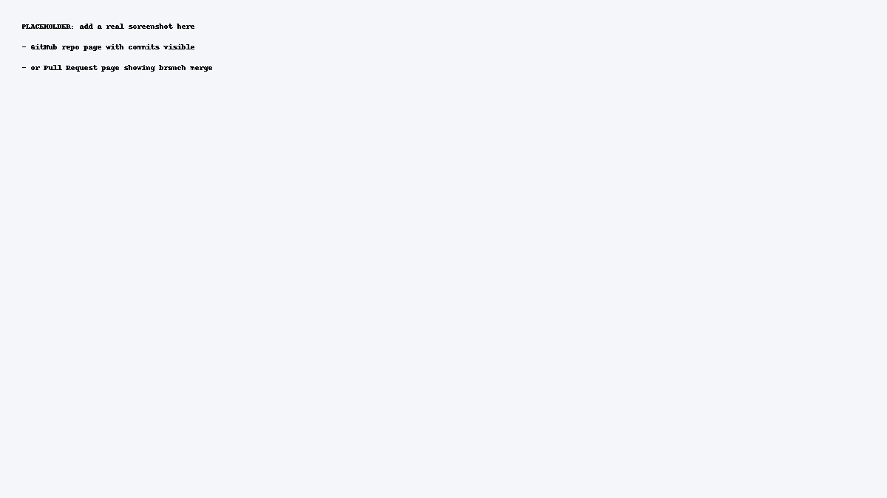

# Название проекта (замени)

## Мета
Коротко: что это за репозиторий и зачем он нужен.

## Функціонал
- [ ] Пункт 1
- [ ] Пункт 2

## Структура
```
.
├── README.md
├── .gitignore
├── src/
├── docs/
└── media/
```
- `src/` — исходный код / примеры файлов
- `docs/` — документация, заметки
- `media/` — скриншоты или превью

## Інструкція запуску / перевірки
1. Опиши, как запустить/посмотреть (если код — команды, если доки — как открыть).
2. Пример:
   ```bash
   python src/example.py
   ```

## Автори
- ПІБ: ___
- Група: ___
- Контакти: email/telegram ___

## Демонстрація
Ниже вставлен скриншот, который доказывает, что репозиторий реальный и коммиты есть.



## Ліцензія (за бажанням)
Например, MIT.
