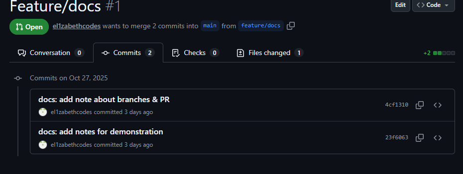

# Навчальний репозиторій з Git/GitHub 

## Мета
Ознайомитись з основними командами та процесом роботи з системою контролю версій **Git** і сервісом **GitHub**. Навчитись створювати репозиторій, працювати з гілками, виконувати коміти та об’єднувати зміни через Pull Request.

## Функціонал
- створення локального та віддаленого репозиторію;
- налаштування SSH-ключа для безпечного доступу;
- робота з гілками (`feature/docs`) та об’єднання у `main`;
- оформлення README-файлу та структури проєкту;
- додавання `.gitignore` і скріншоту з комітами.

## Структура
├── README.md
├── .gitignore
├── src/
│ └── example.py
├── docs/
│ └── README_docs.md
└── media/
└── screenshot-preview.png

## Інструкція запуску / перевірки
1. Відкрити репозиторій на GitHub → переглянути вкладки **Commits** і **Pull requests**.  
2. Локально (якщо встаноsвлений Python) виконати:
   ```bash
   python src/example.py
3. Переглянути docs/README_docs.md — містить нотатки про етапи роботи.

Автор / Контакти

ПІБ: Павлова Єлизавета

Група: P-31

GitHub: @el1zabethcodes

Email: lizapavlova925@gmail.com

## Демонстрація
У папці `media/` знаходиться скріншот, який підтверджує реальні коміти та роботу з гілками:




## Висновок

Репозиторій створено для демонстрації розуміння базових принципів командної розробки з Git.
